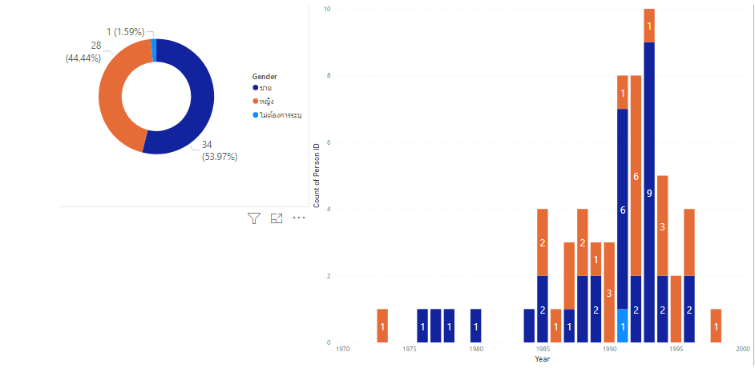
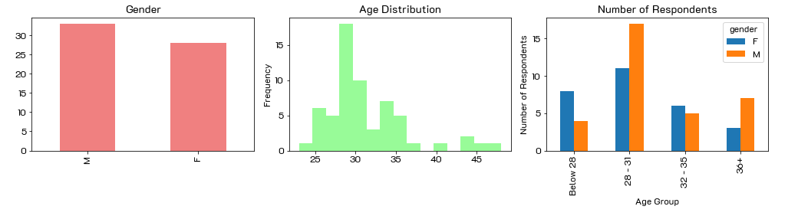
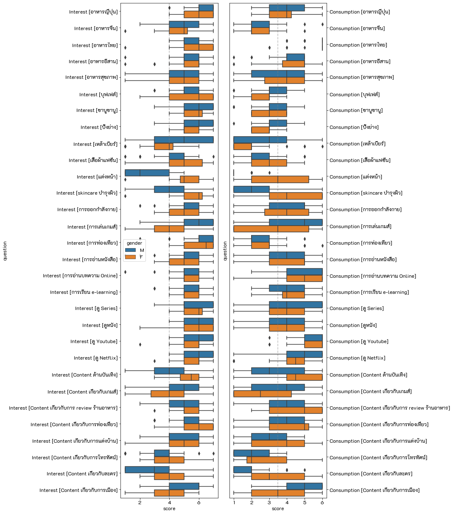

# Customer Behaviors
    
## Dataset  
A survey asking about interests and consumptions of 30 things, e.g., Japanese food, Thai food, Gaming, Cosmetics. The respodents are the students from the class.

**Notebook:** [Analysis of customer behaviors](./HW1_Customer_behavior.ipynb)

Example of the result  
## Demographic

## Frequency
Normalized as percentage count for each question
### Interests

## Side-by-Side Distribution
Comparing distributions of the responses of interest and consumption on the same topic.  

## Summary
ผู้ชายจะชอบบริโภคแอลกอฮอล์มากกว่าผู้หญิง แต่อาจเพราะส่วนมากเป็ฯวัยทำงานแล้วจึงไม่ค่อยมีเวลาไปดื่ม 
ทั้งผู้หญิงและผู้ชายชอบทานอาหารทุกประเภทแต่ไม่ค่อยได้บริโภคจริงๆ 
เรื่องการบำรุงผิวยังมีผู้ชายที่ชื่นชอบอยู่บ้าง แต่เรื่องการซื้อมาใช้นั้นไม่ค่อยบ่อยถ้าเทียบกับผู้หญิง 
เรื่องเกมส์ ผู้ชายจะทั้งชอบและเล่นจริงส่วนผู้หญิงมีแต่ความชอบ แต่ไม่ค่อยได้เล่นจริงๆซักท่าไหร่
