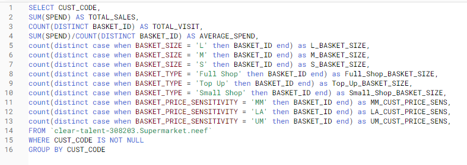
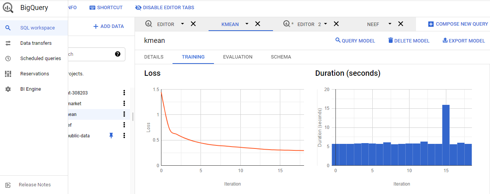
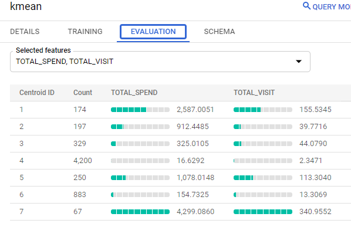
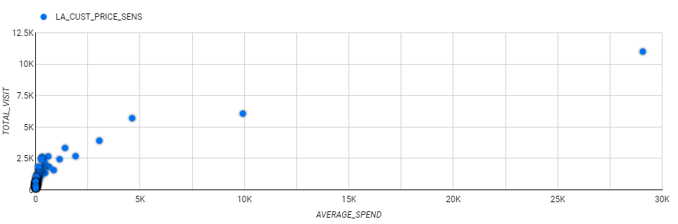
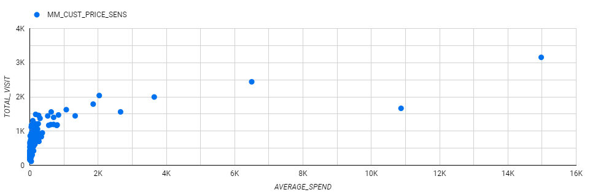
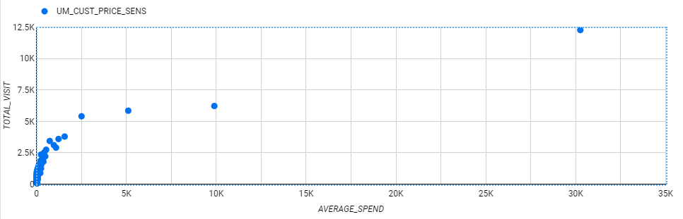

# Customer Segmentation

## Concept of Data Query
The query is trying to compare Total visit and average spending for 3 catagories of customers; Less affluent, middle class, and upper-middle class. \

## Result from K-Mean Traning dataset

## Evaluation

## Scatter plot for less affluent customers

## Scatter plot for middle class customers

## Scatter plot for upper-middle class customers

